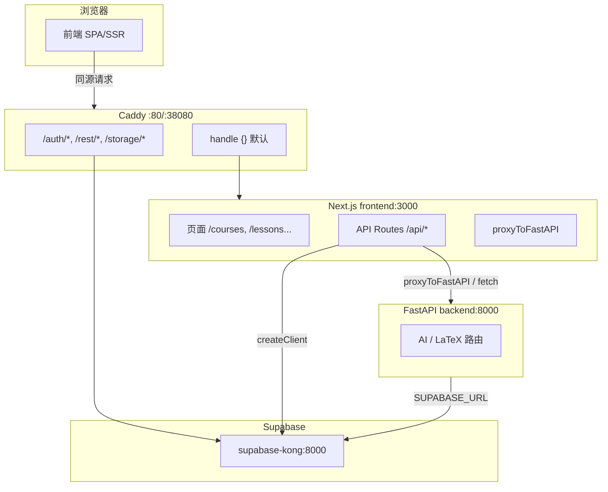

# Vernify 技术栈分析报告

基于 Serena、代码库分析与 explore 结论整理。技术栈 + 数据流唯一源，用于验证架构理解并供 Graphiti 重构使用。

**分析日期**：2026-02-22  
**分析工具**：Serena MCP、Grep、SemanticSearch、直接阅读

---

## 1. 用户理解的架构 vs 实际实现

| 用户理解 | 实际实现 | 备注 |
|---------|----------|------|
| 前端：Next.js | ✅ 一致 | `Web/app/` + `Web/components/` |
| 路由：由 Caddy 管理 | ✅ 一致 | `Web/caddy/Caddyfile` / `Caddyfile.dev` |
| 主后端：Next.js | ✅ 一致 | `app/api/*` 为 BFF |
| FastAPI：为 Next.js 增强能力 | ✅ 一致 | 仅内部被 Next 调用，不对外暴露 |
| Supabase：主要由 Next.js 访问 | ⚠️ 补充 | 前端直接访问 + Next BFF 访问 + FastAPI 也访问（LaTeX 同步等） |

---

## 2. 技术栈清单与版本

### 2.1 前端（Web/）

| 类别 | 技术 | 版本 | 来源 |
|------|------|------|------|
| **框架** | Next.js | ^16.1.0 | package.json |
| | React | ^19.0.0 | package.json |
| | React DOM | ^19.0.0 | package.json |
| **样式** | Tailwind CSS | ^3.4.16 | package.json |
| | @tailwindcss/typography | ^0.5.15 | package.json |
| | DaisyUI | ^5.5.17 | package.json（dev，tailwind.config 中未显式启用） |
| **字体** | LXGW WenKai / 霞鹜文楷 | CDN 1.7.0 | globals.css |
| | LXGW WenKai Mono | CDN 1.7.0 | globals.css |
| **AI** | Vercel AI SDK (ai) | ^6.0.93 | package.json |
| | @ai-sdk/openai | ^3.0.30 | package.json |
| | @ai-sdk/react | ^3.0.95 | package.json |
| **数据与状态** | @tanstack/react-query | ^5.62.0 | package.json |
| | Zustand | ^5.0.11 | package.json |
| **数据库/鉴权** | @supabase/ssr | ^0.8.0 | package.json |
| | @supabase/supabase-js | ^2.49.1 | package.json |
| **内容** | next-mdx-remote | ^6.0.0 | package.json |
| | react-markdown | ^10.0.0 | package.json |
| | remark-gfm | ^4.0.0 | package.json |
| **动画** | framer-motion | ^11.11.17 | package.json |
| | GSAP | ^3.12.5 | package.json |
| **数学/媒体** | MathLive | ^0.108.2 | package.json |
| **图标** | lucide-react | ^0.460.0 | package.json |
| **工具** | Zod | ^4.3.6 | package.json |
| **类型** | TypeScript | ^5.7.2 | package.json |

### 2.2 扩展服务（Web/backend/）

| 类别 | 技术 | 版本 | 来源 |
|------|------|------|------|
| **运行时** | Python | ^3.11 | pyproject.toml |
| **框架** | FastAPI | ^0.109.0 | pyproject.toml |
| | Uvicorn | ^0.27.0 | pyproject.toml |
| **LLM** | LiteLLM | ^1.80.0 | pyproject.toml |
| **任务队列** | Celery (redis) | ^5.3.0 | pyproject.toml |
| **数据库/鉴权** | supabase | ^2.3.0 | pyproject.toml |
| **工具** | structlog | ^24.1.0 | pyproject.toml |

### 2.3 部署与基础设施

| 类别 | 技术 | 版本/说明 | 来源 |
|------|------|----------|------|
| **反向代理** | Caddy | 2.7 | Dockerfile |
| **数据库** | PostgreSQL | 15-alpine | docker-compose.yml |
| **缓存/队列** | Redis | 7-alpine | docker-compose.yml |
| **Supabase 组件** | GoTrue | v2.186.0 | docker-compose.yml |
| | PostgREST | v14.2 | docker-compose.yml |

---

## 3. 请求流：浏览器 → Caddy → Next.js → Supabase / FastAPI

```
┌─────────────┐
│   浏览器     │
└──────┬──────┘
       │ 同源 (http://127.0.0.1:38080 或 localhost:38080)
       ▼
┌─────────────────────────────────────────────────────────────────┐
│                     Caddy (:80 / :38080)                         │
│  handle /auth/*, /rest/*, /storage/*, /realtime/*, /mcp*, /studio/* │
│       │                                                          │
│       ├── /auth/*, /rest/*, /storage/*, /realtime/*, /mcp*       │
│       │         → supabase-kong:8000                             │
│       │                                                          │
│       ├── /studio/*  (dev only)                                  │
│       │         → supabase-studio:3000                           │
│       │                                                          │
│       └── handle {} (default)                                    │
│                 → frontend:3000 (Next.js)                        │
└─────────────────────────────────────────────────────────────────┘
       │
       │ 命中 default 的请求：/, /api/*, /courses, /lessons, ...
       ▼
┌─────────────────────────────────────────────────────────────────┐
│              Next.js (frontend:3000) - 主后端 + BFF               │
│  /api/v1/ai/*, /api/v1/latex/*  → proxyToFastAPI → FastAPI       │
│  /api/v1/courses, lessons, quiz, grading, users → Supabase       │
│  /api/chat → createOpenAI(AI_SERVICE_URL) → FastAPI              │
└─────────────────────────────────────────────────────────────────┘
       │
       ├── Supabase (Auth/REST/Storage)
       └── FastAPI (backend:8000) ← AI_SERVICE_URL
```

**结论**：Caddy **不**访问 FastAPI。FastAPI 仅被 Next.js 内部通过 `AI_SERVICE_URL`（如 `http://backend:8000`）调用。

---

## 4. Caddy 路由配置验证

- **生产**：`handle {}` 默认 → frontend:3000；**无** `/ai/*` 或 FastAPI 路由。
- **开发**：同上；`/api/v1/ai/*` 被 default handle 交给 Next.js → Next 内部 proxyToFastAPI → FastAPI。
- **docker-compose.dev.yml 注释**：若写 `/ai/* → FastAPI` 与实现不符；实际为 `/api/v1/ai/*` 经 Next.js BFF 代理至 FastAPI。

---

## 5. Next.js 与 FastAPI 的调用关系

| 场景 | Next.js 位置 | 调用方式 | FastAPI 路径 |
|------|--------------|----------|--------------|
| AI 代理 | `app/api/v1/ai/[...path]/route.ts` | `proxyToFastAPI` | `/api/v1/ai/*` |
| LaTeX 代理 | `app/api/v1/latex/[...path]/route.ts` | `proxyToFastAPI` | `/api/v1/latex/*` |
| 答题提交 | `app/api/v1/quiz/submit/route.ts` | `fetch(AI_SERVICE_URL/api/v1/ai/grade)` | `/api/v1/ai/grade` |
| 流式对话 | `app/api/chat/route.ts` | `createOpenAI({ baseURL: AI_SERVICE_URL/api/v1/ai })` | `/api/v1/ai` |

- **AI_SERVICE_URL**：默认 `http://backend:8000`，与 Docker 网络一致。

---

## 6. Supabase 访问路径

| 访问方 | 客户端 | 实际请求目标 |
|-------|--------|-------------|
| **浏览器** | `createBrowserClient` | Caddy → Kong |
| **Next.js 服务端** | `createServerClient` | 开发 caddy:38080，生产 kong 直连 |
| **FastAPI** | `backend/app/db/supabase.py` | Kong 直接 |

---

## 7. 技术栈拓扑图（Mermaid）



---

## 8. 数据流简表

| 用户操作 | 数据流 |
|---------|--------|
| 访问首页/课程页 | 浏览器 → Caddy → Next.js → SSR/客户端渲染 |
| 调用 /api/v1/courses | 浏览器 → Caddy → Next.js BFF → Supabase → Kong → PostgREST |
| 调用 /api/v1/ai/grade | 浏览器 → Caddy → Next.js BFF → proxyToFastAPI → FastAPI |
| 调用 /api/chat | 浏览器 → Caddy → Next.js → createOpenAI → FastAPI |
| 登录/登出 | 浏览器 → createBrowserClient → Caddy → Kong (Auth) |
| LaTeX 同步 | Admin → Caddy → Next.js → proxyToFastAPI → FastAPI → Supabase |

---

## 9. 模块边界与 FastAPI 死代码

| 模块 | 前端 (Web) | Next.js BFF | FastAPI (backend) | Supabase |
|------|------------|-------------|-------------------|----------|
| Auth | createBrowserClient | createServerClient | - | GoTrue |
| Course/Lesson | api.courses, api.lessons | app/api/v1/courses, lessons | ❌ 未挂载 | PostgREST |
| Quiz | api.quiz | app/api/v1/quiz | ❌ 未挂载 | PostgREST |
| Grading | api.grading | app/api/v1/grading | -（全部 Next BFF） | PostgREST |
| AI | api.ai, useChat | proxy + quiz/submit 内联 fetch | api/v1/ai, services/ai_service | - |
| LaTeX | api.latex | proxy | api/v1/latex, latex_parser | 写 questions 等表 |

**FastAPI 死代码**：`backend/app/api/v1/__init__.py` 中定义的 courses、lessons、quiz、grading、users 路由从未被 main.py 挂载，属遗留。main.py 仅挂载 `ai_router`、`latex_router`。

---

## 10. Import 与代码分布

### 10.1 前端关键 import

- **Next.js**：`next/server`、`next/navigation`、`next/link`
- **Supabase**：`@supabase/ssr`（createBrowserClient、createServerClient）
- **AI**：`ai`（streamText、convertToModelMessages）、`@ai-sdk/openai`（createOpenAI）、`@ai-sdk/react`（useChat）
- **数据**：`@tanstack/react-query`（useQuery、useMutation）
- **内容**：`next-mdx-remote/rsc`（MDXRemote）、`remark-gfm`

### 10.2 后端关键 import

- **FastAPI**：`fastapi`（APIRouter、HTTPException）
- **LLM**：`litellm`（acompletion、aembedding）
- **数据**：`supabase`（create_client）、`pydantic`（BaseModel）

---

## 11. 版本兼容性约定（来自 project-structure.mdc）

- **Zod v4**：`z.record(z.string(), z.any())`；ZodError 使用 `.error.issues`
- **Next.js 16**：params、searchParams 需 await
- **React 19**：ImgHTMLAttributes 的 src 可能是 `string | Blob`

---

## 12. content/ 与 lib/content 说明

- **根目录**：无 `content/`、`compiler/`。
- **Web/lib/content/**：课时内容领域（lessons-db.ts、lessons.ts），从 DB 读取，非静态文件；与已删除的根目录 content 不同。
- **content_anon**：backend/worker 挂载 `content_anon:/app/content`，避免宿主机根目录创建 Content；应用不依赖 content 目录作为内容源。

---

## 13. 重构建议

| 优先级 | 项目 | 位置 | 说明 |
|--------|------|------|------|
| 高 | 明确 FastAPI 死代码 | backend/app/api/v1/ | 在文档说明或标记 deprecated；courses/lessons/quiz/grading/users 未挂载 |
| 中 | 收紧 grading 类型 | grading/[id]/review/route.ts | `(submission.questions as any)?.max_points` 可改为明确类型 |
| 低 | MODULARIZATION 完成度 | lib/api/endpoints | 已按领域拆分；可继续收紧 ai/latex 返回类型 |

---

## 14. 与用户理解不一致处

1. **Supabase 访问**：浏览器直接访问（Auth、Storage/Realtime）+ Next BFF + FastAPI（LaTeX 同步）均访问 Supabase。
2. **Caddy 与 AI**：Caddy 未配置 `/ai/*`；`/api/v1/ai/*` 经 Next BFF 代理至 FastAPI。

---

*本报告由 docs-updater 根据 explore 分析结论、Serena 与代码库分析整理；技术栈 + 数据流唯一源。*
